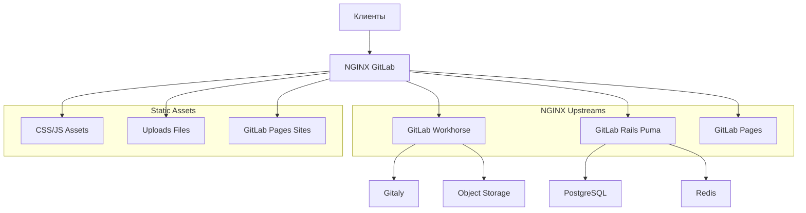
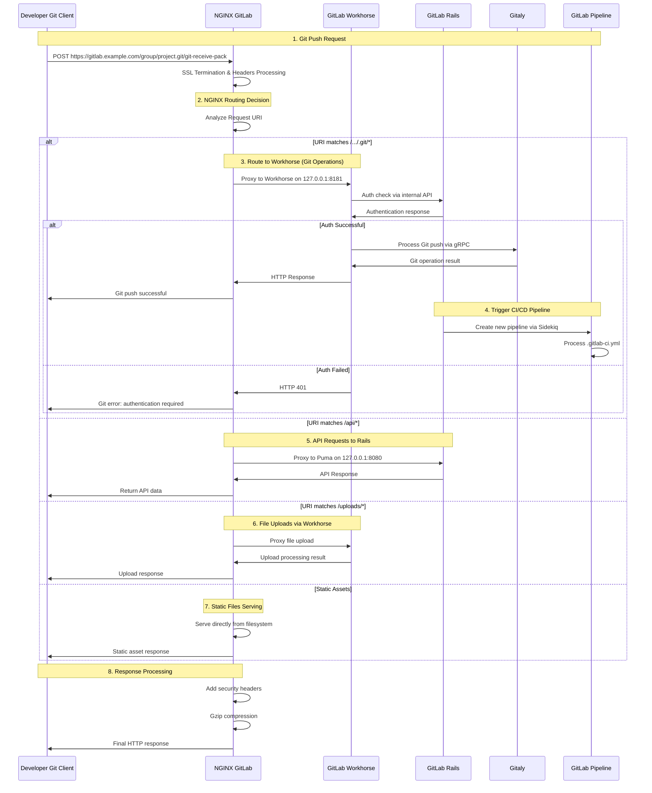
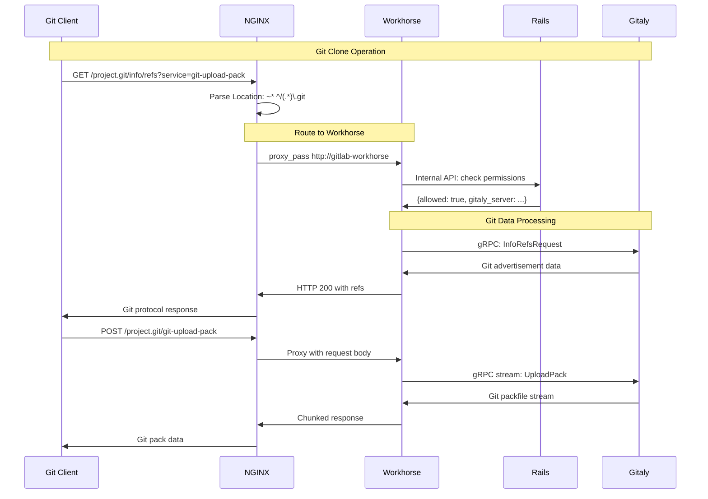
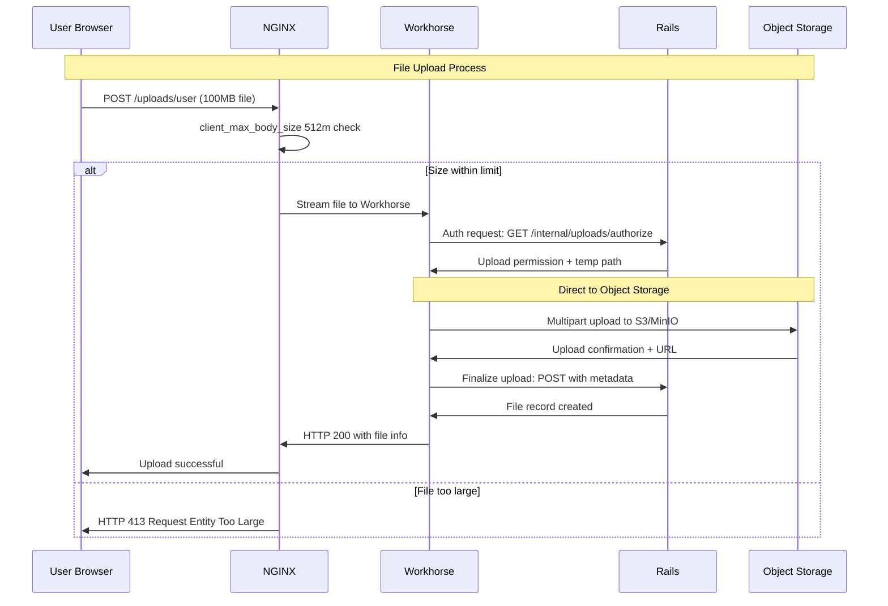

# NGINX в GitLab: подробное описание работы

## 1. Роль NGINX в GitLab

**NGINX** в GitLab выступает как:
- **Обратный прокси** для всех компонентов
- **Балансировщик нагрузки** для Workhorse
- **SSL/TLS терминатор**
- **Статический файловый сервер**
- **Кэширующий прокси**

## 2. Архитектура NGINX в GitLab



## 3. Установка и конфигурация

### Расположение файлов:
```bash
# Конфигурация NGINX
/etc/gitlab/gitlab.rb                    # Основной конфиг
/var/opt/gitlab/nginx/conf/nginx.conf    # Генерируемый конфиг
/var/opt/gitlab/nginx/logs/              # Логи NGINX

# Статические файлы
/opt/gitlab/embedded/service/gitlab-rails/public/
/var/opt/gitlab/gitlab-rails/shared/public/
```

### Конфигурация в gitlab.rb:
```ruby
# Базовые настройки NGINX
nginx['enable'] = true
nginx['listen_addresses'] = ['*']
nginx['listen_port'] = 80
nginx['listen_https'] = false

# SSL настройки
nginx['ssl_certificate'] = "/etc/gitlab/ssl/gitlab.crt"
nginx['ssl_certificate_key'] = "/etc/gitlab/ssl/gitlab.key"
nginx['ssl_ciphers'] = "ECDHE-RSA-AES256-GCM-SHA512:..."
nginx['ssl_prefer_server_ciphers'] = "on"

# Производительность
nginx['worker_processes'] = 4
nginx['worker_connections'] = 10240
nginx['keepalive_timeout'] = 65
nginx['gzip'] = "on"
nginx['gzip_types'] = [
  "text/plain",
  "text/css",
  "application/json",
  "application/x-javascript",
  "text/xml",
  "application/xml",
  "application/xml+rss",
  "text/javascript"
]

# Upstreams
nginx['proxy_set_headers'] = {
  "X-Forwarded-Proto" => "https",
  "X-Forwarded-Ssl" => "on",
  "Host" => "$http_host",
  "X-Real-IP" => "$remote_addr",
  "X-Forwarded-For" => "$proxy_add_x_forwarded_for"
}
```

## 4. Полный процесс обработки запроса при коммите



## 5. Детальная маршрутизация запросов

```mermaid
flowchart TB
    A[HTTP Request] --> B{NGINX Routing}
    
    B --> C[Git Operations]
    B --> D[API Requests]
    B --> E[File Uploads]
    B --> F[Static Assets]
    B --> G[Web UI]
    B --> H[WebSocket]
    
    C --> I[/\.git\/.*/]
    I --> J[Workhorse: 8181]
    
    D --> K[/^\/api\/.*/]
    K --> L[Rails Puma: 8080]
    
    E --> M[/^\/uploads\/.*/]
    M --> J
    
    F --> N[/\.css|\.js|\.png|\.ico/]
    N --> O[Static Filesystem]
    
    G --> P[/^\/(?!api|uploads).*/]
    P --> J
    
    H --> Q[/\/cable/]
    Q --> J
    
    J --> R[Response]
    L --> R
    O --> R
```

## 6. Обработка Git HTTP-запросов



## 7. Конфигурация виртуальных хостов

### Сгенерированный nginx.conf:
```nginx
# Основной server блок
server {
    listen *:80;
    server_name gitlab.example.com;
    server_tokens off;
    
    # Корневая директория
    root /opt/gitlab/embedded/service/gitlab-rails/public;
    
    # Статические assets
    location ~ ^/assets/ {
        expires max;
        add_header Cache-Control public;
        etag on;
        gzip_static on;
    }
    
    # Git HTTP обработка
    location ~ ^/(?<namespace>[\w\.-]+)/(?<project>[\w\.-]+)\.git/ {
        proxy_pass http://gitlab-workhorse;
        proxy_set_header Host $host;
        proxy_set_header X-Real-IP $remote_addr;
        proxy_set_header X-Forwarded-For $proxy_add_x_forwarded_for;
        proxy_set_header X-Forwarded-Proto $scheme;
    }
    
    # API запросы
    location ~ ^/api/v\d+/ {
        proxy_pass http://gitlab-puma;
        proxy_read_timeout 300;
        proxy_connect_timeout 300;
        proxy_redirect off;
    }
    
    # Загрузка файлов
    location ~ ^/uploads/ {
        proxy_pass http://gitlab-workhorse;
        client_max_body_size 0;
    }
    
    # WebSocket для Live Features
    location /-/cable {
        proxy_pass http://gitlab-workhorse;
        proxy_http_version 1.1;
        proxy_set_header Upgrade $http_upgrade;
        proxy_set_header Connection "upgrade";
    }
    
    # Основное приложение
    location / {
        proxy_pass http://gitlab-workhorse;
        proxy_set_header Host $http_host;
        proxy_set_header X-Real-IP $remote_addr;
        proxy_set_header X-Forwarded-For $proxy_add_x_forwarded_for;
        proxy_set_header X-Forwarded-Proto $scheme;
    }
}

# Upstreams
upstream gitlab-workhorse {
    server 127.0.0.1:8181;
}

upstream gitlab-puma {
    server 127.0.0.1:8080;
}
```

## 8. Обработка больших файлов и загрузок



## 9. SSL/TLS терминация

```nginx
server {
    listen 443 ssl http2;
    server_name gitlab.example.com;
    
    # SSL сертификаты
    ssl_certificate /etc/gitlab/ssl/gitlab.crt;
    ssl_certificate_key /etc/gitlab/ssl/gitlab.key;
    
    # Modern SSL configuration
    ssl_protocols TLSv1.2 TLSv1.3;
    ssl_ciphers ECDHE-RSA-AES256-GCM-SHA512:...;
    ssl_prefer_server_ciphers on;
    
    # Security headers
    add_header Strict-Transport-Security "max-age=31536000; includeSubDomains" always;
    add_header X-Content-Type-Options nosniff;
    add_header X-Frame-Options DENY;
    add_header X-XSS-Protection "1; mode=block";
    
    # OCSP stapling
    ssl_stapling on;
    ssl_stapling_verify on;
    
    # Диффи-Хеллман параметры
    ssl_dhparam /etc/ssl/certs/dhparam.pem;
}
```

## 10. Мониторинг и логи

### Статус NGINX:
```bash
# Проверка статуса
sudo gitlab-ctl status nginx

# Логи в реальном времени
sudo gitlab-ctl tail nginx

# Проверка конфигурации
sudo /opt/gitlab/embedded/sbin/nginx -t

# Статистика соединений
sudo netstat -tlnp | grep nginx
```

### Ключевые метрики:
```bash
# Access logs
tail -f /var/log/gitlab/nginx/gitlab_access.log

# Error logs  
tail -f /var/log/gitlab/nginx/gitlab_error.log

# Формат логов
log_format gitlab_access '$remote_addr - $remote_user [$time_local] '
                         '"$request" $status $body_bytes_sent '
                         '"$http_referer" "$http_user_agent"';
```

## 11. Производительность и кэширование

### Конфигурация кэширования:
```nginx
# Кэширование статических assets
location ~* \.(js|css|png|jpg|jpeg|gif|ico|svg)$ {
    expires 1y;
    add_header Cache-Control "public, immutable";
    add_header ETag "";
}

# Кэширование API ответов
location ~ ^/api/v\d+/projects/.*/repository/archive {
    proxy_cache gitlab-api;
    proxy_cache_valid 200 302 10m;
    proxy_cache_use_stale error timeout updating;
    add_header X-Cache-Status $upstream_cache_status;
}

# Кэш зоны
proxy_cache_path /var/cache/nginx levels=1:2 keys_zone=gitlab-api:10m max_size=1g;
```

## 12. Безопасность

### Заголовки безопасности:
```nginx
# Security headers
add_header X-Frame-Options "SAMEORIGIN" always;
add_header X-Content-Type-Options "nosniff" always;
add_header X-XSS-Protection "1; mode=block" always;
add_header Referrer-Policy "strict-origin-when-cross-origin" always;
add_header Content-Security-Policy "default-src 'self' ..." always;

# Rate limiting
limit_req_zone $binary_remote_addr zone=gitlab:10m rate=10r/s;

location /users/sign_in {
    limit_req zone=gitlab burst=5 nodelay;
}
```

