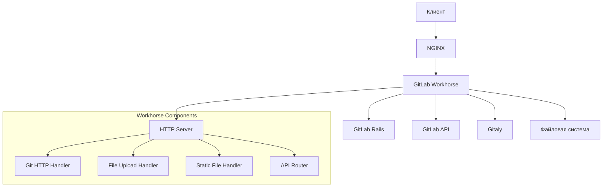
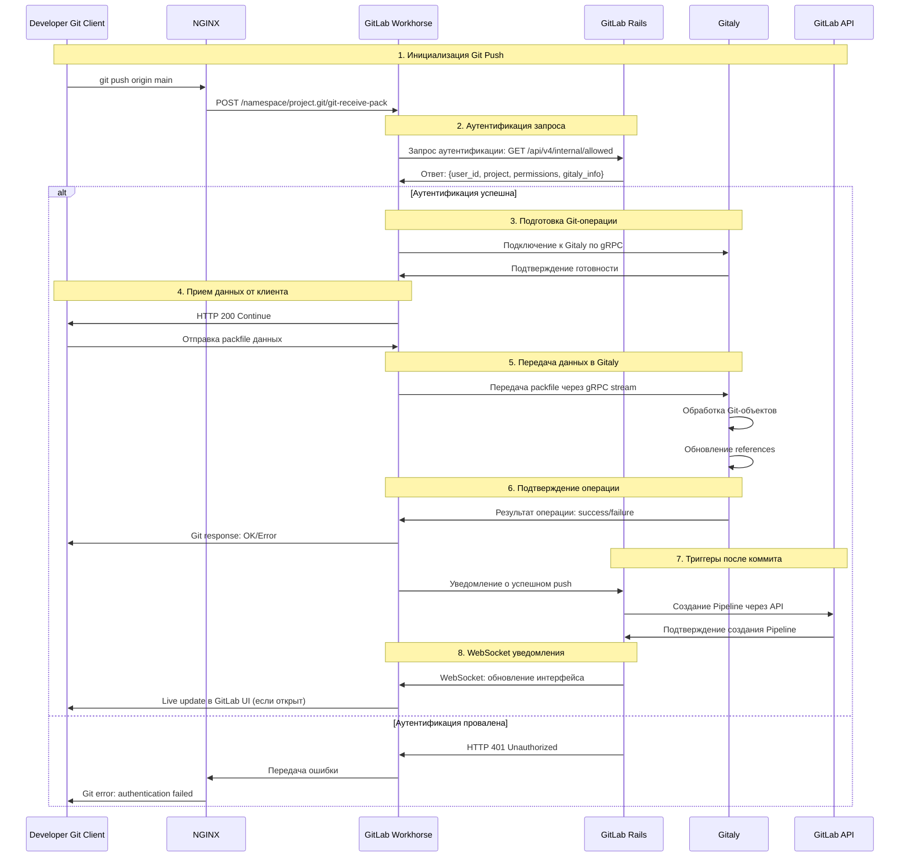
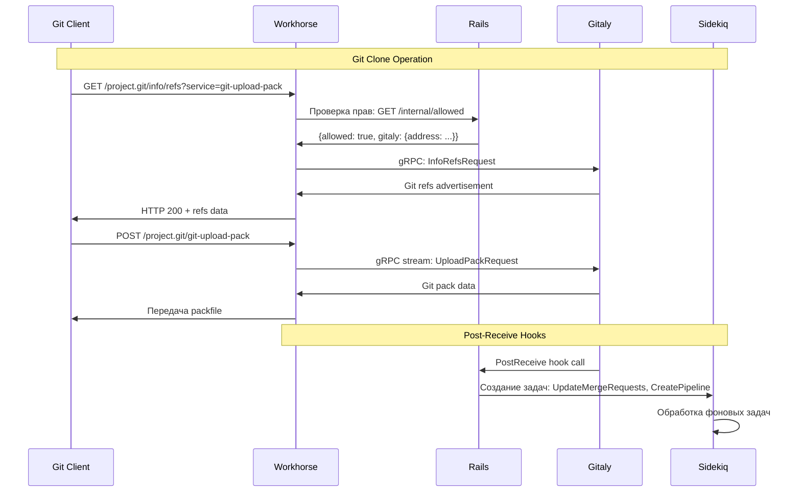
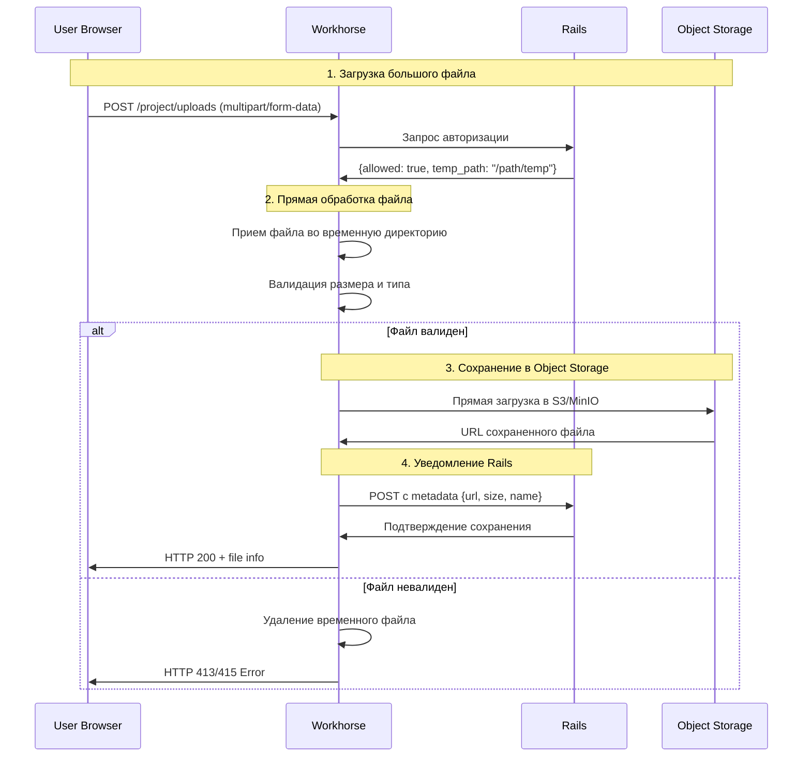
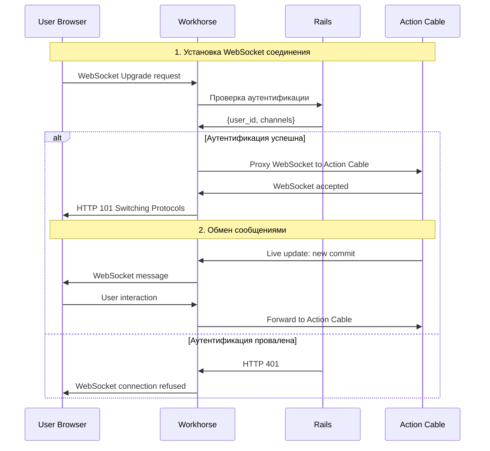
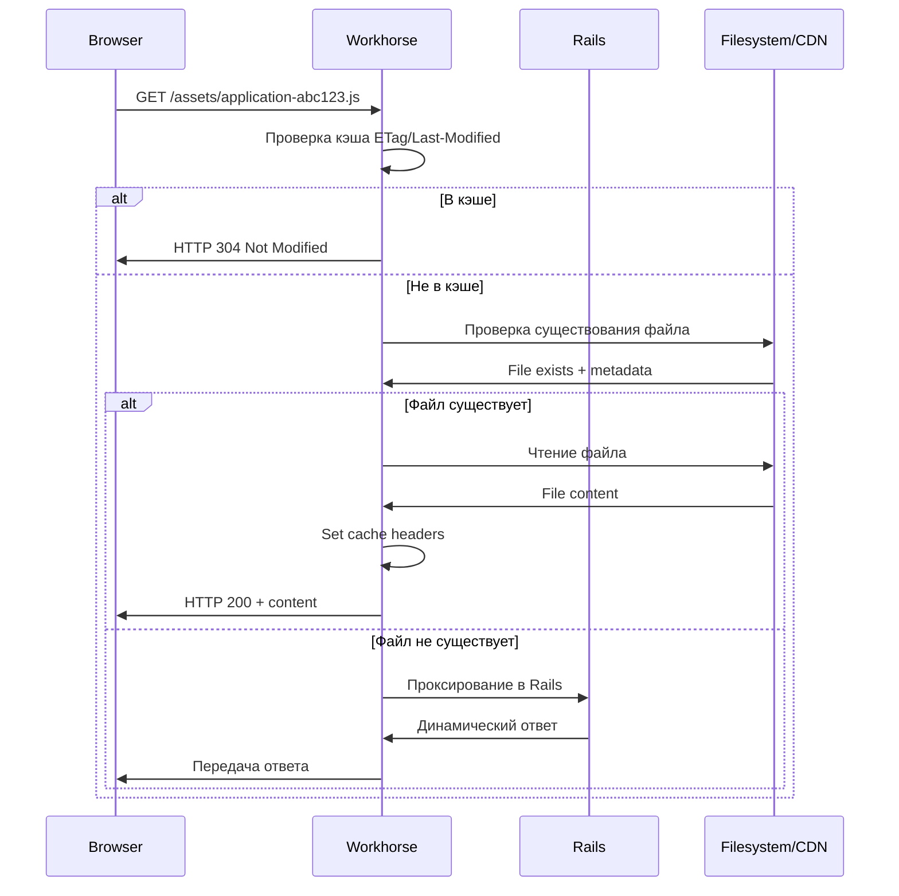

# GitLab Workhorse: подробное описание работы

## 1. Что такое GitLab Workhorse

**GitLab Workhorse** - это умный обратный прокси-сервер, написанный на Go, который обрабатывает "тяжелые" HTTP-запросы, разгружая основное Rails-приложение.

### Основные функции:
- **Обработка больших файлов** - загрузка/скачивание
- **Git-операции** - clone, push, pull
- **Статические файлы** - отдача assets
- **WebSocket** - обработка Live Features
- **API-рутинг** - интеллектуальная маршрутизация запросов

## 2. Архитектура Workhorse



## 3. Установка и конфигурация

### Workhorse поставляется с GitLab:
```bash
# Расположение Workhorse
/opt/gitlab/embedded/bin/gitlab-workhorse
/var/opt/gitlab/gitlab-workhorse/

# Конфигурационные файлы
/var/opt/gitlab/gitlab-workhorse/config.toml
```

### Конфигурация в gitlab.rb:
```ruby
# Настройки Workhorse
gitlab_workhorse['enable'] = true
gitlab_workhorse['listen_network'] = "tcp"
gitlab_workhorse['listen_addr'] = "127.0.0.1:8181"
gitlab_workhorse['auth_backend'] = "http://127.0.0.1:8080" # GitLab Rails
gitlab_workhorse['auth_socket'] = "/var/opt/gitlab/gitlab-rails/sockets/gitlab.socket"

# Настройки производительности
gitlab_workhorse['proxy_headers_timeout'] = "1m"
gitlab_workhorse['api_limit'] = 0
gitlab_workhorse['api_queue_limit'] = 0
gitlab_workhorse['api_queue_duration'] = "30s"
```

## 4. Полный процесс обработки запроса при коммите



## 5. Детальный процесс обработки Git HTTP запросов



## 6. Обработка больших файлов



## 7. Конфигурация Workhorse

### Файл config.toml:
```toml
[redis]
    Password = "redis-password"
    URL = "tcp://localhost:6379"

[auth]
    Socket = "/var/opt/gitlab/gitlab-rails/sockets/gitlab.socket"
    Backend = "http://localhost:8080"

[object_storage]
    Provider = "AWS"

[object_storage.s3]
    AWSAccessKeyID = "access-key"
    AWSSecretAccessKey = "secret-key"

[listener]
    Network = "tcp"
    Addr = ":8181"
```

## 8. Мониторинг и логи

### Метрики Workhorse:
```bash
# Статус Workhorse
sudo gitlab-ctl status gitlab-workhorse

# Логи в реальном времени
sudo gitlab-ctl tail gitlab-workhorse

# Метрики Prometheus
curl http://localhost:9229/metrics
```

### Ключевые метрики:
```prometheus
# HTTP запросы
gitlab_workhorse_http_requests_total{method="POST",code="200"}
gitlab_workhorse_http_request_duration_seconds

# Git операции
gitlab_workhorse_git_http_requests_total{type="git-receive-pack"}
gitlab_workhorse_git_http_requests_total{type="git-upload-pack"}

# Загрузка файлов
gitlab_workhorse_uploads_total
gitlab_workhorse_upload_errors_total
```

## 9. Процесс обработки WebSocket



## 10. Обработка статических файлов



## 11. Безопасность Workhorse

### Механизмы безопасности:
- **JWT токены** для внутренней аутентификации
- **Проверка прав доступа** для каждого запроса
- **Лимиты размеров** файлов
- **Валидация MIME-типов**
- **Изоляция исполнения** от основного приложения

### Конфигурация безопасности:
```ruby
# В gitlab.rb
gitlab_workhorse['trusted_cidr_for_x_forwarded_for'] = ['127.0.0.1/32']
gitlab_workhorse['trusted_cidr_for_propagation'] = ['127.0.0.1/32']
```

Эта архитектура позволяет GitLab эффективно обрабатывать тяжелые операции, разгружая Rails-приложение и обеспечивая высокую производительность даже при большой нагрузке.