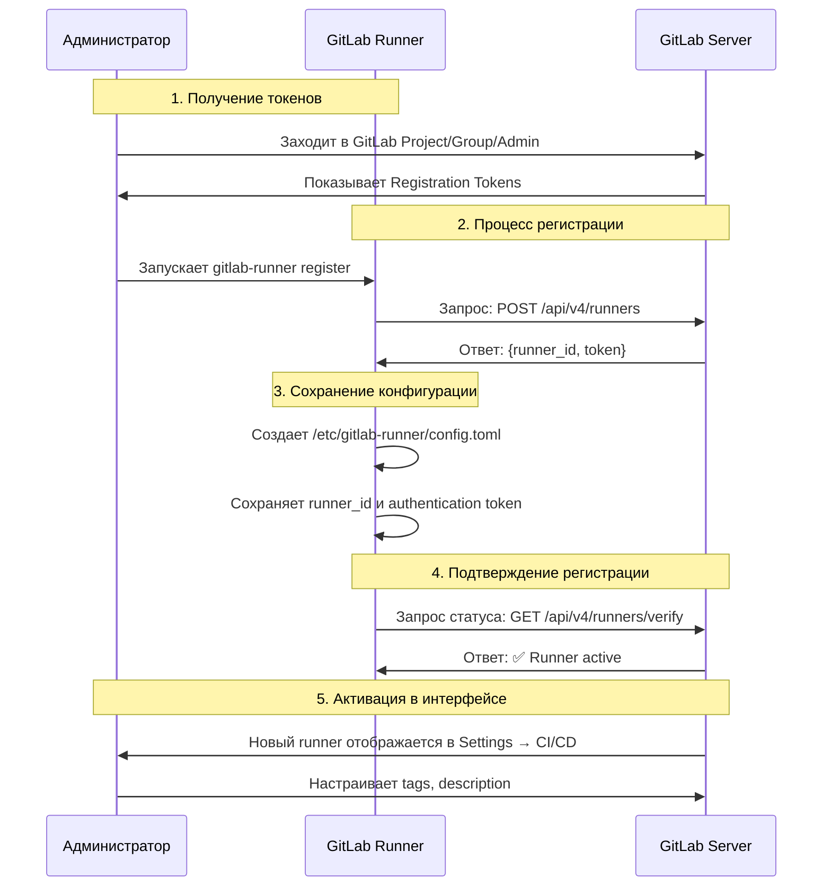
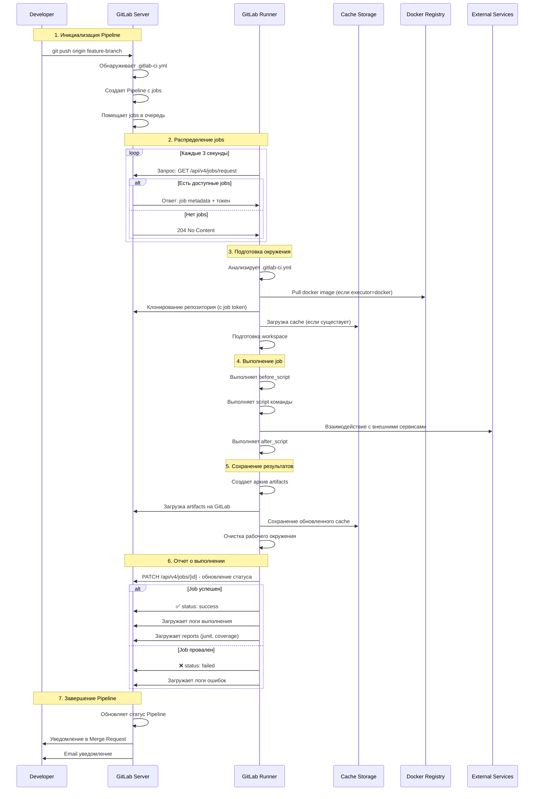
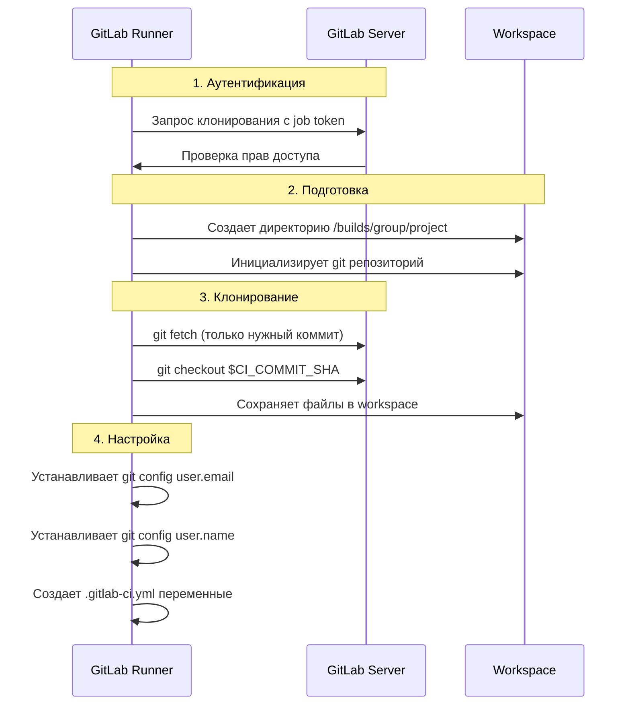
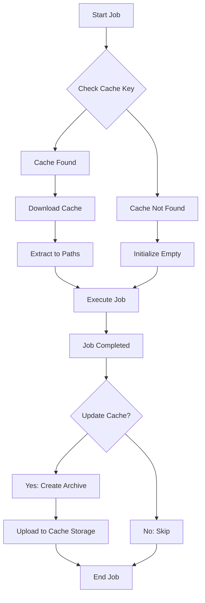

# GitLab Runner: подробное описание работы

## 1. Архитектура GitLab Runner

### Компоненты Runner:
- **GitLab Runner** - основное приложение
- **Executor** - среда выполнения jobs (Docker, Shell, Kubernetes)
- **Config.toml** - файл конфигурации
- **GitLab Server** - координация и управление

## 2. Установка и регистрация Runner

### Установка на Ubuntu:
```bash
# Добавление репозитория
curl -L "https://packages.gitlab.com/install/repositories/runner/gitlab-runner/script.deb.sh" | sudo bash

# Установка
sudo apt-get install gitlab-runner

# Запуск службы
sudo systemctl enable gitlab-runner
sudo systemctl start gitlab-runner
```

### Регистрация Runner:
```bash
sudo gitlab-runner register
```

## 3. Процесс регистрации Runner



## 4. Детальная конфигурация config.toml

```toml
# Глобальные настройки
concurrent = 4          # Максимум одновременных jobs
check_interval = 0      # Интервал опроса сервера (секунды)

# Настройки логов
log_level = "info"
log_format = "text"

# Настройки сессий
session_timeout = 1800  # Таймаут сессии (секунды)

[[runners]]
  # Основные настройки runner
  name = "ubuntu-docker-runner"
  url = "https://gitlab.example.com"
  token = "glrt-xxxxxxxxxxxxxxxx"  # Authentication token
  executor = "docker"              # Тип исполнителя
  
  # Настройки Docker executor
  [runners.docker]
    image = "alpine:latest"        # Образ по умолчанию
    privileged = false             # Привилегированный режим
    disable_entrypoint_overwrite = false
    oom_kill_disable = false
    disable_cache = false
    volumes = ["/cache", "/var/run/docker.sock:/var/run/docker.sock"]
    shm_size = 0
    
  # Кэширование
  [runners.cache]
    Type = "s3"                    # Тип кэша
    [runners.cache.s3]
      ServerAddress = "s3.amazonaws.com"
      AccessKey = "your-access-key"
      SecretKey = "your-secret-key"
      BucketName = "gitlab-runner-cache"
      BucketLocation = "us-east-1"
      
  # Настройки контейнера
  [runners.custom_build_dir]
  [runners.cache]
    [runners.cache.gcs]
    [runners.cache.azure]
```

## 5. Полный процесс выполнения CI/CD Pipeline



## 6. Типы Executors и их работа

### Docker Executor (наиболее популярный):
```toml
[[runners]]
  executor = "docker"
  [runners.docker]
    image = "node:16"
    privileged = false
    volumes = [
      "/cache",
      "/builds:/builds",
      "/var/run/docker.sock:/var/run/docker.sock"
    ]
    pull_policy = "if-not-present"
```

### Shell Executor:
```toml
[[runners]]
  executor = "shell"
  environment = [
    "PATH=/usr/local/sbin:/usr/local/bin:/usr/sbin:/usr/bin:/sbin:/bin"
  ]
```

### Kubernetes Executor:
```toml
[[runners]]
  executor = "kubernetes"
  [runners.kubernetes]
    namespace = "gitlab-runner"
    cpu_limit = "1"
    memory_limit = "1Gi"
```

## 7. Процесс клонирования репозитория



## 8. Кэширование и artifacts

### Процесс работы с кэшем:


### Конфигурация кэша в .gitlab-ci.yml:
```yaml
cache:
  key: ${CI_COMMIT_REF_SLUG}
  paths:
    - node_modules/
    - .npm/
  policy: pull-push

build:
  stage: build
  script:
    - npm install
    - npm run build
  artifacts:
    paths:
      - dist/
    expire_in: 1 week
```

## 9. Мониторинг и отладка Runner

### Команды управления:
```bash
# Статус runner
sudo gitlab-runner status

# Список зарегистрированных runners
sudo gitlab-runner list

# Проверка конфигурации
sudo gitlab-runner verify

# Просмотр логов
sudo journalctl -u gitlab-runner -f

# Запуск в debug режиме
sudo gitlab-runner run --debug
```

### Метрики и мониторинг:
```toml
# В config.toml
metrics_server = ":9252"  # Prometheus metrics endpoint

# Проверка метрик
curl http://localhost:9252/metrics
```

## 10. Безопасность Runner

### Рекомендации по безопасности:
```toml
[[runners]]
  # Ограничение tags
  tag_list = ["docker", "linux"]
  
  # Запуск от непривилегированного пользователя
  [runners.docker]
    privileged = false
    userns_mode = "host"
    
  # Ограничение сетевого доступа
  [runners.docker]
    network_mode = "bridge"
    extra_hosts = ["gitlab.example.com:192.168.1.100"]
```

