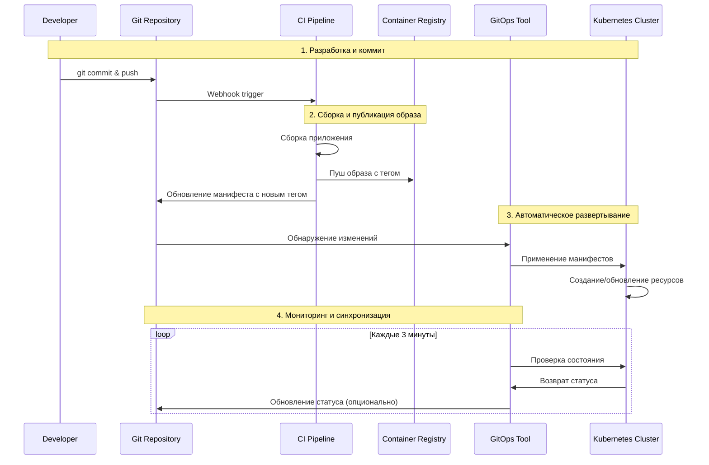
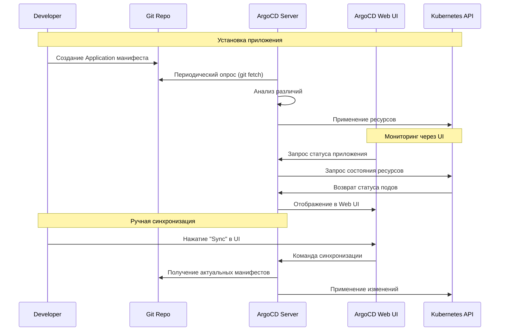
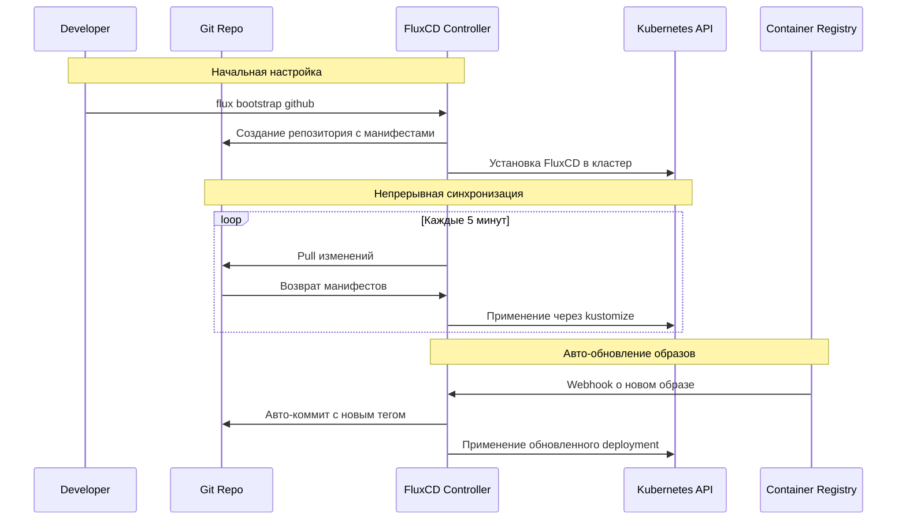
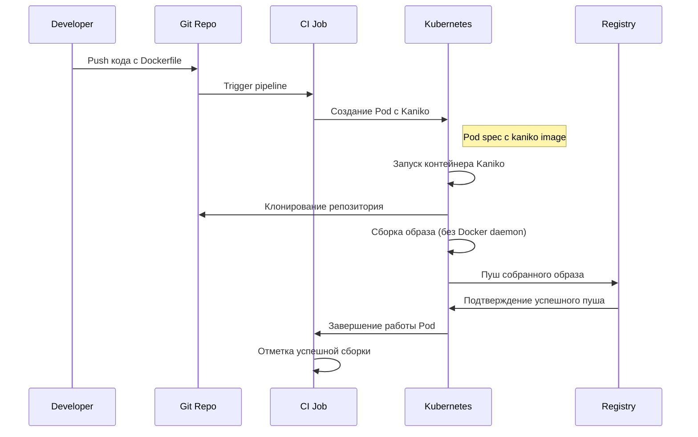
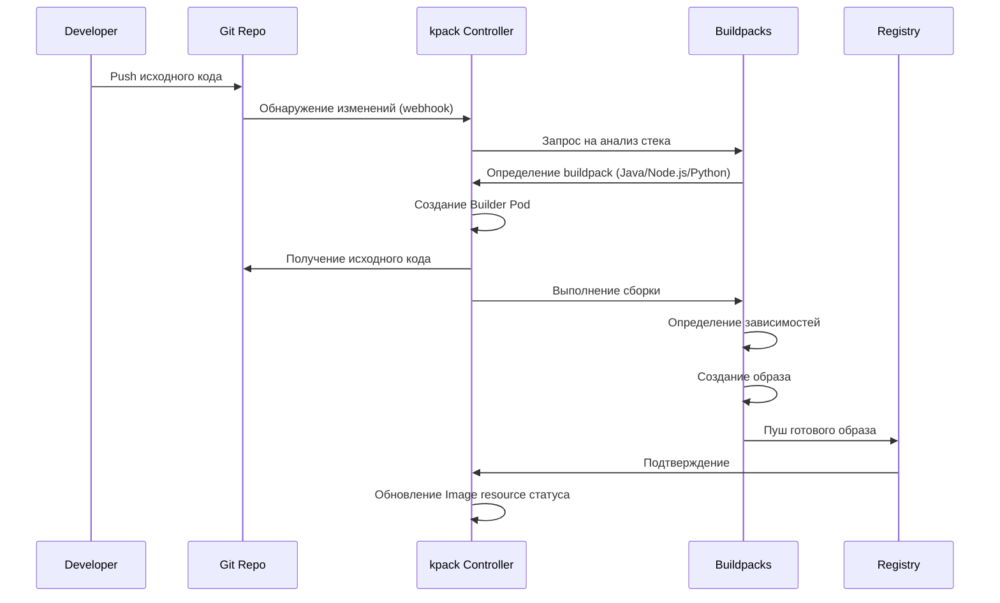
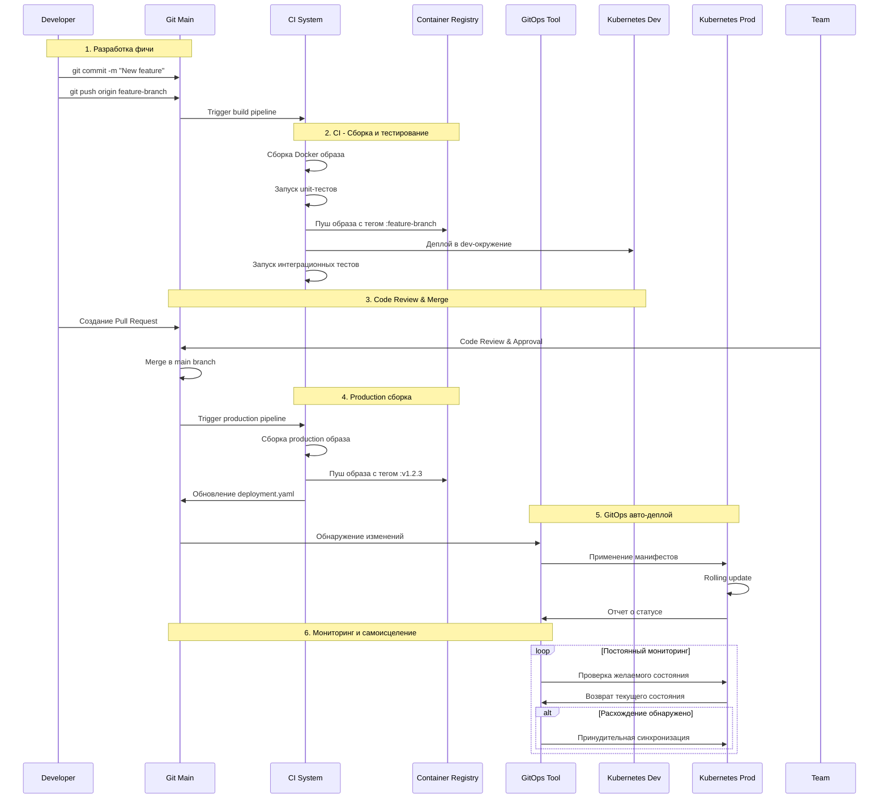
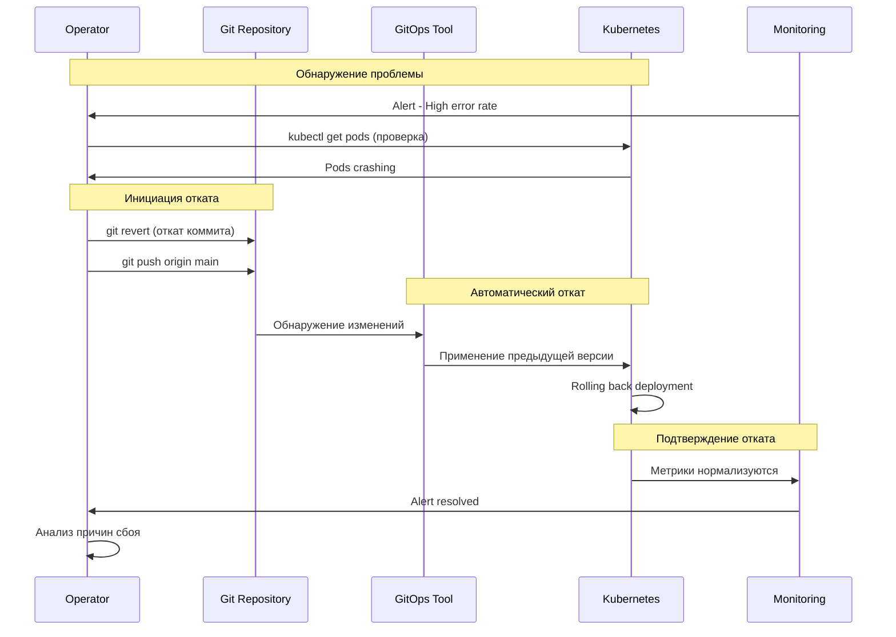
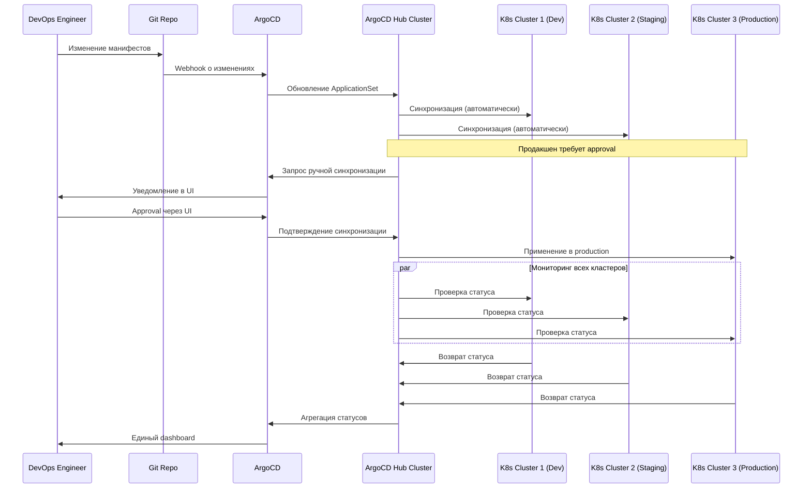

# **Диаграмма последовательности GitOps**

## **🔄 Общая схема GitOps workflow**



---

## **⚔️ ArgoCD vs FluxCD: Детальные диаграммы**

### **ArgoCD Workflow:**



### **FluxCD Workflow:**



---

## **🏗️ Сборка образов в кластере**

### **Kaniko Build Sequence:**



### **Buildpacks Automated Build:**



---

## **🚀 End-to-End GitOps Pipeline**

### **Полный цикл от кода до продакшена:**



---

## **🔧 Обработка ошибок в GitOps**

### **Sequence Diagram для отката (Rollback):**



---

## **🎯 Multi-Cluster GitOps**

### **Управление несколькими кластерами:**




# **GitOps подход: Полное руководство для начинающих**

## **🎯 Что такое GitOps?**

**GitOps** — это методология развертывания и управления инфраструктурой, где Git репозиторий является единственным источником истины.

**Простая аналогия:**
- **Git** — как чертеж здания
- **Kubernetes** — как строительная площадка  
- **GitOps инструмент** — как прораб, который следит чтобы реальность соответствовала чертежам

---

## **📚 Основные принципы GitOps**

### **1. Declarative (Декларативный подход)**
```yaml
# Вместо КАК сделать (императивно):
kubectl create deployment nginx --image=nginx:latest
kubectl scale deployment nginx --replicas=3

# Мы описываем ЧТО хотим (декларативно):
apiVersion: apps/v1
kind: Deployment
metadata:
  name: nginx
spec:
  replicas: 3
  template:
    spec:
      containers:
      - name: nginx
        image: nginx:latest
```

### **2. Versioned and Immutable (Версионирование и неизменяемость)**
- Все конфигурации хранятся в Git
- Каждый коммит = новая версия инфраструктуры
- Возможность отката к любой предыдущей версии

### **3. Automated (Автоматизация)**
- Автоматическое применение изменений из Git
- Непрерывная синхронизация
- Автоматическое исправление дрейфа конфигурации

### **4. Observable (Наблюдаемость)**
- Понятный статус синхронизации
- Уведомления о расхождениях
- История изменений

---

## **⚔️ ArgoCD vs FluxCD**

### **ArgoCD**

**Архитектура:**
```
Git Repo → ArgoCD Server → Kubernetes API
         ↑
ArgoCD UI & CLI
```

**Особенности:**
- **Web UI** - богатый графический интерфейс
- **Multi-cluster** - управление несколькими кластерами
- **Sync Windows** - окна для развертывания
- **ApplicationSet** - генерация приложений по шаблонам
- **SSO Integration** - интеграция с системами аутентификации

**Установка:**
```bash
kubectl create namespace argocd
kubectl apply -n argocd -f https://raw.githubusercontent.com/argoproj/argo-cd/stable/manifests/install.yaml

# Получить пароль admin
kubectl -n argocd get secret argocd-initial-admin-secret -o jsonpath="{.data.password}" | base64 -d
```

**Пример Application:**
```yaml
apiVersion: argoproj.io/v1alpha1
kind: Application
metadata:
  name: my-app
  namespace: argocd
spec:
  project: default
  source:
    repoURL: https://github.com/my-org/my-app.git
    targetRevision: HEAD
    path: k8s/manifests
  destination:
    server: https://kubernetes.default.svc
    namespace: my-app
  syncPolicy:
    automated:
      prune: true
      selfHeal: true
```

### **FluxCD**

**Архитектура:**
```
Git Repo ←→ FluxCD Controller → Kubernetes API
               ↑
        Image Automation
```

**Особенности:**
- **Git-first** - тесная интеграция с Git
- **Image Automation** - автоматическое обновление образов
- **Kustomize support** - встроенная поддержка Kustomize
- **Lightweight** - легковесный и простой
- **Notification** - система уведомлений

**Установка:**
```bash
flux bootstrap github \
  --owner=my-org \
  --repository=my-infra \
  --branch=main \
  --path=./clusters/my-cluster \
  --personal
```

**Пример настройки:**
```yaml
apiVersion: source.toolkit.fluxcd.io/v1beta1
kind: GitRepository
metadata:
  name: my-app
  namespace: flux-system
spec:
  interval: 1m0s
  url: https://github.com/my-org/my-app
  ref:
    branch: main
---
apiVersion: kustomize.toolkit.fluxcd.io/v1beta1
kind: Kustomization
metadata:
  name: my-app
  namespace: flux-system
spec:
  interval: 5m0s
  path: ./k8s
  prune: true
  sourceRef:
    kind: GitRepository
    name: my-app
  targetNamespace: my-app
```

### **Сравнительная таблица:**

| **Критерий** | **ArgoCD** | **FluxCD** |
|--------------|------------|------------|
| **UI** | ✅ Богатый Web UI | ⚠️ Базовый UI |
| **Сложность** | Средняя | Простая |
| **Multi-cluster** | ✅ Отлично | ✅ Хорошо |
| **Image Automation** | ⚠️ Через плагины | ✅ Встроенная |
| **Сообщество** | Очень большое | Большое |
| **Подход** | Application-centric | Git-centric |

---

## **🔄 Declarative Continuous Delivery**

### **Традиционный CD vs GitOps CD**

**Традиционный CD:**
```
Code → CI Pipeline → kubectl apply → Kubernetes
```

**Проблемы:**
- Расхождения между Git и кластером
- Ручные операции
- Сложный откат

**GitOps CD:**
```
Git Repo ←→ GitOps Tool → Kubernetes
     ↑
CI Pipeline (только сборка образов)
```

### **Принципы Declarative CD:**

**1. Git как источник истины:**
```bash
# Вместо прямых команд в кластер
git add manifests/
git commit -m "Deploy v1.2.3"
git push origin main

# ArgoCD/FluxCD автоматически применяют изменения
```

**2. Автоматическая синхронизация:**
```yaml
# ArgoCD
syncPolicy:
  automated:
    prune: true
    selfHeal: true

# FluxCD
spec:
  interval: 5m0s
```

**3. Самоисцеление (Self-healing):**
- Если кто-то вручную изменит ресурс в кластере
- GitOps инструмент вернет его к состоянию из Git

### **Пример workflow:**

```bash
# 1. Разработчик пушит изменения в Git
git add .
git commit -m "Add new feature"
git push

# 2. CI пайплайн собирает образ
docker build -t my-registry/app:v1.2.3 .
docker push my-registry/app:v1.2.3

# 3. Разработчик обновляет манифест в Git
# image: my-registry/app:v1.2.3
git add manifests/deployment.yaml
git commit -m "Update to v1.2.3"
git push

# 4. GitOps инструмент автоматически развертывает
```

---

## **🏗️ Сборка образов в кластере**

### **Проблема традиционного подхода:**
```bash
# Сборка на CI-сервере
docker build -t my-app .
docker push my-registry/my-app

# Проблемы:
# - Зависимость от внешнего Docker
# - Проблемы безопасности
# - Непереносимость
```

### **Решения для сборки в кластере:**

### **1. Buildpacks**

**Аналогично Heroku buildpacks - автоматическое определение стека приложения**

**Установка:**
```bash
kubectl apply -f https://github.com/buildpacks-community/kpack/releases/latest/download/release-0.12.2.yaml
```

**Пример:**
```yaml
apiVersion: kpack.io/v1alpha2
kind: ClusterStore
metadata:
  name: default
spec:
  sources:
  - image: paketobuildpacks/build:base
---
apiVersion: kpack.io/v1alpha2
kind: ClusterStack
metadata:
  name: base
spec:
  id: "io.buildpacks.stacks.bionic"
  buildImage:
    image: "paketobuildpacks/build:base-cnb"
  runImage:
    image: "paketobuildpacks/run:base-cnb"
---
apiVersion: kpack.io/v1alpha2
kind: Image
metadata:
  name: my-app-image
  namespace: default
spec:
  tag: my-registry/my-app
  serviceAccount: builder-service-account
  builder:
    name: my-builder
    kind: ClusterBuilder
  source:
    git:
      url: https://github.com/my-org/my-app
      revision: main
```

### **2. Kaniko**

**Сборка образов без доступа к Docker daemon**

**Пример Pod:**
```yaml
apiVersion: v1
kind: Pod
metadata:
  name: kaniko-build
spec:
  containers:
  - name: kaniko
    image: gcr.io/kaniko-project/executor:latest
    args:
    - --dockerfile=Dockerfile
    - --context=git://github.com/my-org/my-app.git
    - --destination=my-registry/my-app:v1.0.0
    - --cache=true
    volumeMounts:
    - name: kaniko-secret
      mountPath: /kaniko/.docker
  volumes:
  - name: kaniko-secret
    secret:
      secretName: regcred
      items:
      - key: .dockerconfigjson
        path: config.json
```

### **3. BuildKit + Kubernetes**

**Использование BuildKit в кластере**

**Установка:**
```bash
kubectl apply -f https://github.com/moby/buildkit/master/examples/kubernetes/deployment.yaml
```

**Пример Build:**
```yaml
apiVersion: batch/v1
kind: Job
metadata:
  name: buildkit-build
spec:
  template:
    spec:
      containers:
      - name: buildkit
        image: moby/buildkit:latest
        command: ["buildctl"]
        args:
        - "build"
        - "--frontend=dockerfile.v0"
        - "--local context=."
        - "--local dockerfile=."
        - "--output type=image,name=my-registry/my-app:pushed=true"
        volumeMounts:
        - name: buildkit-socket
          mountPath: /run/buildkit
      volumes:
      - name: buildkit-socket
        hostPath:
          path: /run/buildkit
```

### **4. Tekton Pipelines**

**Cloud-native CI/CD в Kubernetes**

**Установка:**
```bash
kubectl apply --filename https://storage.googleapis.com/tekton-releases/pipeline/latest/release.yaml
```

**Пример Task:**
```yaml
apiVersion: tekton.dev/v1beta1
kind: Task
metadata:
  name: build-and-push
spec:
  params:
  - name: imageUrl
    type: string
  - name: imageTag
    type: string
  steps:
  - name: build
    image: gcr.io/kaniko-project/executor:latest
    args:
    - --dockerfile=Dockerfile
    - --context=.
    - --destination=$(params.imageUrl):$(params.imageTag)
```

---

## **🚀 Полный GitOps workflow**

### **Архитектура:**
```
Developer → Git Repo → ArgoCD/FluxCD → Kubernetes
              ↑
           CI Pipeline (Tekton/GitHub Actions)
              ↓
        Container Registry
```

### **Пример реализации:**

**1. Структура репозитория:**
```
my-app/
├── src/                    # Исходный код
├── Dockerfile             # Для сборки образа
├── k8s/                   # Kubernetes манифесты
│   ├── deployment.yaml
│   ├── service.yaml
│   └── kustomization.yaml
└── .github/workflows/     # CI пайплайн
    └── ci.yaml
```

**2. CI пайплайн (.github/workflows/ci.yaml):**
```yaml
name: Build and Deploy
on:
  push:
    branches: [main]

jobs:
  build:
    runs-on: ubuntu-latest
    steps:
    - uses: actions/checkout@v2
    
    - name: Build Docker image
      run: |
        docker build -t my-registry/my-app:$GITHUB_SHA .
        docker push my-registry/my-app:$GITHUB_SHA
        
    - name: Update k8s manifests
      run: |
        sed -i 's|image: my-registry/my-app:.*|image: my-registry/my-app:'$GITHUB_SHA'|' k8s/deployment.yaml
        
    - name: Commit changes
      run: |
        git config --local user.email "action@github.com"
        git config --local user.name "GitHub Action"
        git add k8s/deployment.yaml
        git commit -m "Update image to $GITHUB_SHA"
        git push
```

**3. GitOps синхронизация:**
- ArgoCD/FluxCD отслеживают изменения в Git
- Автоматически применяют обновленные манифесты
- Кластер всегда соответствует состоянию в Git

---

## **🎯 Преимущества GitOps**

### **✅ Для разработки:**
- **Скорость** - быстрые и безопасные развертывания
- **Надежность** - воспроизводимые окружения
- **Откат** - один клик для отката любой версии

### **✅ Для операций:**
- **Безопасность** - Git как единая точка контроля
- **Наблюдаемость** - понятный статус всех окружений
- **Автоматизация** - минимум ручной работы

### **✅ Для бизнеса:**
- **Аудит** - полная история изменений
- **Compliance** - соответствие требованиям
- **Эффективность** - меньше ошибок, быстрее доставка

**GitOps превращает развертывание из искусства в науку! 🚀**