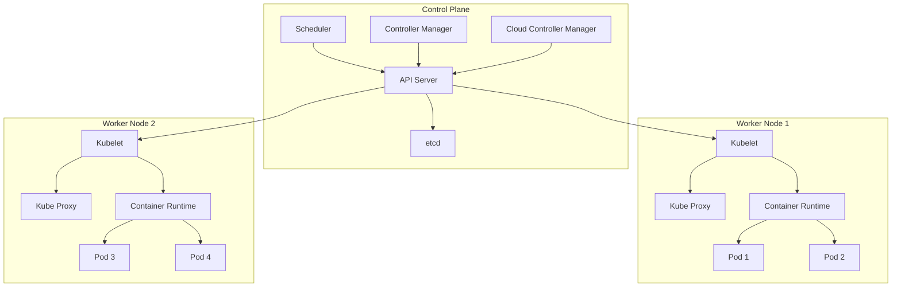
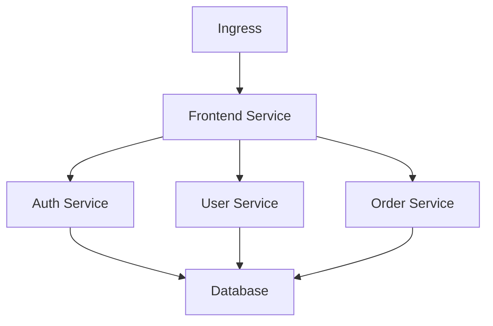

# Kubernetes: Подробное руководство

## Что такое Kubernetes?

**Kubernetes** (также известный как K8s) — это открытая платформа для автоматизации развертывания, масштабирования и управления контейнеризированными приложениями. Это система оркестрации контейнеров, которая изначально была разработана Google и сейчас поддерживается Cloud Native Computing Foundation (CNCF).

## Основные концепции

### 1. Контейнеры и их проблемы
```bash
# Без Kubernetes - управление контейнерами вручную
docker run -d --name app1 nginx
docker run -d --name app2 nginx
docker run -d --name app3 nginx

# Проблемы:
# - Что если контейнер упадет?
# - Как масштабировать?
# - Как обновлять без простоя?
# - Как управлять сетью?
```

### 2. Kubernetes как решение
Kubernetes решает эти проблемы, предоставляя:
- **Автоматическое восстановление** при падении контейнеров
- **Горизонтальное масштабирование** на основе нагрузки
- **Бесперебойные обновления**
- **Сервис-дискавери** и балансировка нагрузки
- **Управление конфигурациями** и секретами

## Архитектура Kubernetes



### Компоненты Control Plane

#### 1. kube-apiserver
```yaml
# Пример API запроса
apiVersion: v1
kind: Pod
metadata:
  name: my-pod
spec:
  containers:
  - name: nginx
    image: nginx:1.21
```
- **Функция**: Фронтенд Kubernetes API
- **Задачи**: Валидация запросов, аутентификация, авторизация
- **Особенности**: Единственный компонент, с которым взаимодействуют пользователи

#### 2. etcd
```bash
# Хранит состояние кластера в формате ключ-значение
/registry/pods/default/my-pod
/registry/services/default/my-service
/registry/nodes/node-1
```
- **Функция**: Распределенное key-value хранилище
- **Задачи**: Хранение состояния всего кластера
- **Особенности**: Высокая доступность и надежность

#### 3. kube-scheduler
```go
// Псевдокод логики планировщика
func schedulePod(pod *Pod) *Node {
    // Фильтрация узлов по ресурсам
    feasibleNodes := filterNodesByResources(pod)
    
    // Оценка узлов по приоритетам
    scores := scoreNodes(feasibleNodes, pod)
    
    // Выбор лучшего узла
    return selectBestNode(scores)
}
```
- **Функция**: Распределение Pod'ов по узлам
- **Задачи**: Учет ресурсов, политик, требований к оборудованию

#### 4. kube-controller-manager
```go
// Контроллер ReplicaSet
func ReplicaSetController() {
    for {
        // Проверяем текущее количество Pod'ов
        currentPods := getCurrentPods(replicaSet)
        
        // Сравниваем с желаемым состоянием
        if currentPods < replicaSet.Spec.Replicas {
            createNewPod(replicaSet)
        } else if currentPods > replicaSet.Spec.Replicas {
            deleteExtraPod(replicaSet)
        }
        
        time.Sleep(10 * time.Second)
    }
}
```
- **Функция**: Запуск контроллеров (Node, Replication, Endpoints, etc.)
- **Задачи**: Поддержание желаемого состояния кластера

### Компоненты Worker Nodes

#### 1. kubelet
```bash
# kubelet получает от API Server:
- Какие Pod'ы должны работать на узле
- Конфигурации контейнеров
- Требования к ресурсам

# kubelet обеспечивает:
- Запуск/остановку контейнеров
- Мониторинг здоровья
- Отчетность о состоянии
```
- **Функция**: Агент на каждом узле
- **Задачи**: Управление жизненным циклом Pod'ов

#### 2. kube-proxy
```go
// Поддержка правил iptables для Service
func updateIPTables(service *Service) {
    // Создание правил для балансировки нагрузки
    for _, pod := range service.Endpoints {
        addRule(service.ClusterIP, pod.IP)
    }
}
```
- **Функция**: Сетевой прокси
- **Задачи**: Балансировка нагрузки, сервис-дискавери

#### 3. Container Runtime
```bash
# Поддерживаемые runtime:
- Docker
- Containerd
- CRI-O
- Kata Containers
```
- **Функция**: Запуск контейнеров
- **Задачи**: Управление жизненным циклом контейнеров

## Ключевые объекты Kubernetes

### 1. Pod
```yaml
apiVersion: v1
kind: Pod
metadata:
  name: my-app-pod
  labels:
    app: my-app
    version: "1.0"
spec:
  containers:
  - name: nginx
    image: nginx:1.21
    ports:
    - containerPort: 80
    env:
    - name: ENVIRONMENT
      value: "production"
    resources:
      requests:
        memory: "64Mi"
        cpu: "250m"
      limits:
        memory: "128Mi"
        cpu: "500m"
```
**Что такое Pod:**
- Наименьшая deployable единица в Kubernetes
- Группа из одного или нескольких контейнеров
- Разделяет сетевое пространство и хранилище
- Имеет единый IP адрес

### 2. Deployment
```yaml
apiVersion: apps/v1
kind: Deployment
metadata:
  name: nginx-deployment
spec:
  replicas: 3
  selector:
    matchLabels:
      app: nginx
  strategy:
    type: RollingUpdate
    rollingUpdate:
      maxSurge: 1
      maxUnavailable: 0
  template:
    metadata:
      labels:
        app: nginx
    spec:
      containers:
      - name: nginx
        image: nginx:1.21.1
        ports:
        - containerPort: 80
```
**Функции Deployment:**
- Управление ReplicaSet'ами
- Бесперебойные обновления (rolling updates)
- Откат к предыдущим версиям
- Масштабирование количества реплик

### 3. Service
```yaml
apiVersion: v1
kind: Service
metadata:
  name: my-service
spec:
  selector:
    app: nginx
  ports:
  - name: http
    protocol: TCP
    port: 80
    targetPort: 80
  type: LoadBalancer
```
**Типы Service:**
- **ClusterIP**: Внутренний IP (по умолчанию)
- **NodePort**: Открывает порт на каждом узле
- **LoadBalancer**: Внешний балансировщик нагрузки
- **ExternalName**: CNAME запись

### 4. ConfigMap и Secret
```yaml
# ConfigMap
apiVersion: v1
kind: ConfigMap
metadata:
  name: app-config
data:
  config.properties: |
    server.port=8080
    logging.level=INFO

# Secret
apiVersion: v1
kind: Secret
metadata:
  name: app-secret
type: Opaque
data:
  username: YWRtaW4=
  password: cGFzc3dvcmQ=
```

## Работа с Kubernetes

### Базовые команды kubectl
```bash
# Просмотр ресурсов
kubectl get pods
kubectl get services
kubectl get deployments

# Детальная информация
kubectl describe pod my-pod
kubectl describe service my-service

# Создание ресурсов
kubectl apply -f deployment.yaml
kubectl create deployment nginx --image=nginx:1.21

# Управление Pod'ами
kubectl logs my-pod
kubectl exec -it my-pod -- /bin/bash
kubectl port-forward my-pod 8080:80

# Масштабирование
kubectl scale deployment nginx --replicas=5
```

### Пример полного приложения
```yaml
# deployment.yaml
apiVersion: apps/v1
kind: Deployment
metadata:
  name: web-app
spec:
  replicas: 3
  selector:
    matchLabels:
      app: web
  template:
    metadata:
      labels:
        app: web
    spec:
      containers:
      - name: web
        image: nginx:1.21
        ports:
        - containerPort: 80
        livenessProbe:
          httpGet:
            path: /
            port: 80
          initialDelaySeconds: 5
          periodSeconds: 10
---
# service.yaml
apiVersion: v1
kind: Service
metadata:
  name: web-service
spec:
  selector:
    app: web
  ports:
  - port: 80
    targetPort: 80
  type: LoadBalancer
```

## Преимущества Kubernetes

### 1. Автоматизация операций
```bash
# Kubernetes автоматически:
- Перезапускает упавшие контейнеры
- Распределяет нагрузку между Pod'ами
- Обновляет приложения без простоя
- Масштабирует на основе метрик
```

### 2. Переносимость
```yaml
# Один и тот же манифест работает везде
apiVersion: apps/v1
kind: Deployment
metadata:
  name: my-app
spec:
  replicas: 3
  template:
    spec:
      containers:
      - name: app
        image: my-registry/my-app:v1.0
        ports:
        - containerPort: 8080
```

### 3. Масштабируемость
```bash
# От одного узла до тысяч
kubectl get nodes
# NAME STATUS ROLES AGE VERSION
# node-1 Ready <none> 1d v1.25.0
# node-2 Ready <none> 1d v1.25.0
# node-1000 Ready <none> 1d v1.25.0
```

## Экосистема Kubernetes

### Инструменты и расширения
```bash
# Мониторинг
- Prometheus + Grafana
- EFK Stack (Elasticsearch, Fluentd, Kibana)

# CI/CD
- Jenkins X
- ArgoCD
- Tekton

# Безопасность
- Falco
- Trivy
- OPA Gatekeeper

# Сетевые решения
- Calico
- Flannel
- Istio (service mesh)
```

## Типичные use cases

### 1. Веб-приложения
```yaml
apiVersion: apps/v1
kind: Deployment
metadata:
  name: frontend
spec:
  replicas: 5
  template:
    spec:
      containers:
      - name: frontend
        image: my-company/frontend:v2.1
---
apiVersion: apps/v1
kind: Deployment
metadata:
  name: backend
spec:
  replicas: 3
  template:
    spec:
      containers:
      - name: backend
        image: my-company/backend:v1.5
```

### 2. Микросервисная архитектура


### 3. Пакетная обработка данных
```yaml
apiVersion: batch/v1
kind: Job
metadata:
  name: data-processor
spec:
  completions: 5
  parallelism: 2
  template:
    spec:
      containers:
      - name: processor
        image: data-processor:latest
        command: ["python", "process.py"]
      restartPolicy: Never
```

## Заключение

Kubernetes — это мощная платформа, которая превращает управление контейнерами из рутинной задачи в автоматизированный процесс. Она предоставляет:

- **Отказоустойчивость**: Автоматическое восстановление при сбоях
- **Масштабируемость**: Легкое увеличение/уменьшение ресурсов
- **Переносимость**: Единая среда от разработки до продакшена
- **Экосистему**: Богатый набор инструментов и расширений

Благодаря этим возможностям Kubernetes стал стандартом де-факто для оркестрации контейнеров в современной IT-инфраструктуре.