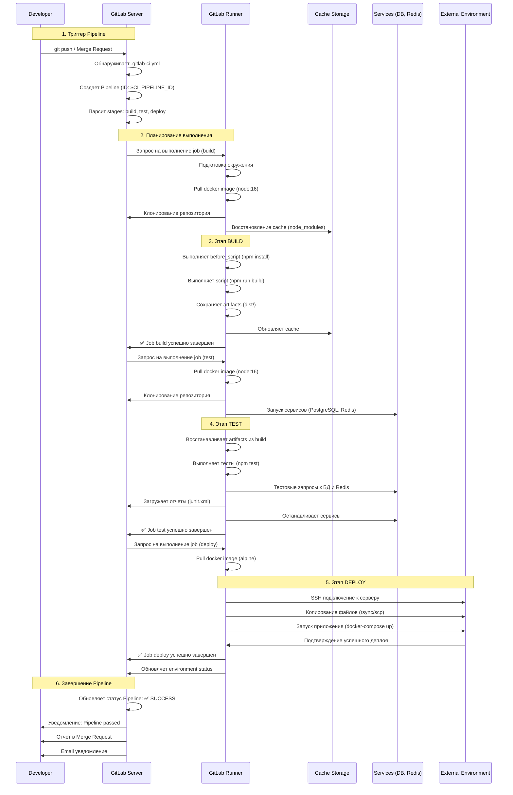
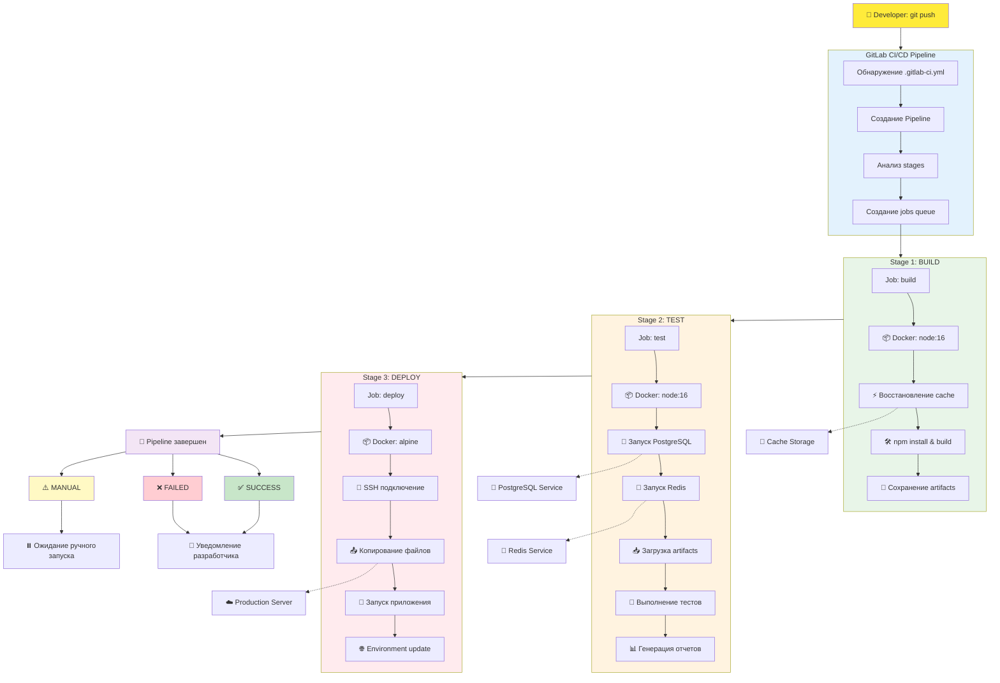

## Детальное описание процесса:

### 1. **Инициализация Pipeline**
- **Developer** делает `git push` в репозиторий
- **GitLab** обнаруживает файл `.gitlab-ci.yml`
- Создается новый **Pipeline** с уникальным ID
- Анализируются **stages** и создаются **jobs**

### 2. **Подготовка выполнения**
- Для каждого **job** находится подходящий **Runner**
- **Runner** подготавливает окружение:
  - Скачивает указанный **Docker image**
  - Клонирует код репозитория
  - Восстанавливает **cache** (если доступен)

### 3. **Выполнение этапов**
#### Stage 1: Build
- Выполняется **before_script**
- Запускаются команды **script**
- Сохраняются **artifacts** (результаты сборки)
- Обновляется **cache**

#### Stage 2: Test 
- Запускаются **services** (базы данных, Redis)
- Восстанавливаются **artifacts** из предыдущего stage
- Выполняются тесты
- Загружаются отчеты в GitLab

#### Stage 3: Deploy
- Выполняется деплой на целевое окружение
- Обновляется статус **environment** в GitLab

### 4. **Завершение Pipeline**
- **Runner** отправляет результаты в **GitLab**
- Обновляется статус **Pipeline**
- Отправляются уведомления **Developer**

## Ключевые компоненты:

- **Runner** - изолированная среда выполнения jobs
- **Cache** - кэширование зависимостей между запусками  
- **Artifacts** - передача файлов между stages
- **Services** - вспомогательные сервисы для тестов
- **Environment** - целевые окружения для деплоя

### Ключевые процессы:

- **Cache**: Восстановление зависимостей между запусками
- **Artifacts**: Передача файлов между этапами
- **Services**: Временные сервисы для тестирования
- **Environments**: Управление окружениями деплоя

