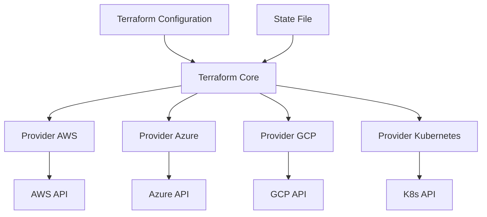
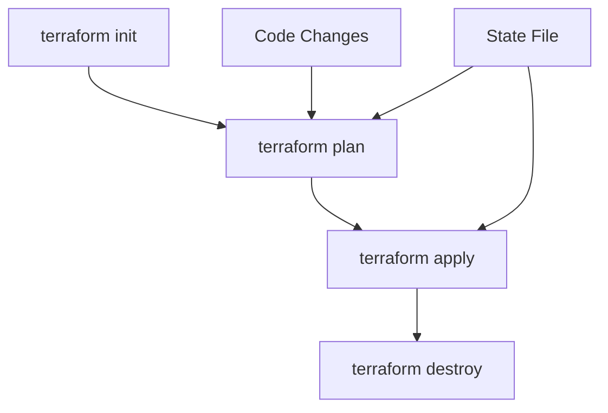

# Terraform: Полный разбор технологии и инструкция

## Что такое Terraform?

**Terraform** - это инструмент Infrastructure as Code (IaC) от HashiCorp для безопасного и эффективного создания, изменения и версионирования инфраструктуры.

### Ключевые концепции:
- **Infrastructure as Code** - инфраструктура описывается в коде
- **Declarative** - описываем ЧТО хотим, а не КАК сделать
- **Idempotent** - многократное применение дает одинаковый результат
- **Cloud Agnostic** - работает с 100+ провайдерами

---

## Архитектура Terraform



---

## 📋 Полная инструкция по установке и настройке

### 1. Установка Terraform

#### На Linux (Ubuntu/Debian):
```bash
# Установка через apt
curl -fsSL https://apt.releases.hashicorp.com/gpg | sudo apt-key add -
sudo apt-add-repository "deb [arch=amd64] https://apt.releases.hashicorp.com $(lsb_release -cs) main"
sudo apt update && sudo apt install terraform

# Проверка установки
terraform version
```

#### На Windows (Chocolatey):
```powershell
choco install terraform
```

#### На MacOS (Homebrew):
```bash
brew tap hashicorp/tap
brew install hashicorp/tap/terraform
```

### 2. Базовая структура проекта

```
my-terraform-project/
├── main.tf              # Основная конфигурация
├── variables.tf         # Переменные
├── outputs.tf           # Выходные значения
├── terraform.tfvars     # Значения переменных
├── providers.tf         # Настройки провайдеров
└── modules/             # Кастомные модули
    └── vpc/
        ├── main.tf
        ├── variables.tf
        └── outputs.tf
```

---

## 🏗️ Создание первой конфигурации

### Шаг 1: Настройка провайдера AWS

```hcl
# providers.tf
terraform {
  required_version = ">= 1.0"
  
  required_providers {
    aws = {
      source  = "hashicorp/aws"
      version = "~> 5.0"
    }
  }

  # Хранение state файла в S3 (опционально)
  backend "s3" {
    bucket = "my-terraform-state-bucket"
    key    = "terraform.tfstate"
    region = "us-east-1"
  }
}

# Настройка провайдера AWS
provider "aws" {
  region = var.aws_region
  
  # Assume Role для безопасного доступа
  assume_role {
    role_arn = "arn:aws:iam::123456789012:role/TerraformRole"
  }
  
  # Дефолтные теги для всех ресурсов
  default_tags {
    tags = {
      Environment = var.environment
      Project     = "my-project"
      ManagedBy   = "terraform"
    }
  }
}
```

### Шаг 2: Определение переменных

```hcl
# variables.tf

# Базовые переменные
variable "aws_region" {
  description = "AWS region to deploy resources"
  type        = string
  default     = "us-east-1"
}

variable "environment" {
  description = "Environment name (dev, staging, prod)"
  type        = string
  validation {
    condition     = contains(["dev", "staging", "prod"], var.environment)
    error_message = "Environment must be dev, staging, or prod."
  }
}

variable "vpc_cidr" {
  description = "CIDR block for VPC"
  type        = string
  default     = "10.0.0.0/16"
}

# Переменные с чувствительными данными
variable "db_password" {
  description = "Database administrator password"
  type        = string
  sensitive   = true
}
```

### Шаг 3: Значения переменных

```hcl
# terraform.tfvars
environment = "dev"
vpc_cidr    = "10.0.0.0/16"

# secrets.auto.tfvars (в .gitignore)
db_password = "super-secret-password-123"
```

### Шаг 4: Создание ресурсов

```hcl
# main.tf

# Создание VPC
resource "aws_vpc" "main" {
  cidr_block           = var.vpc_cidr
  enable_dns_hostnames = true
  enable_dns_support   = true
  
  tags = {
    Name = "${var.environment}-vpc"
  }
}

# Создание Internet Gateway
resource "aws_internet_gateway" "main" {
  vpc_id = aws_vpc.main.id
  
  tags = {
    Name = "${var.environment}-igw"
  }
}

# Создание Subnets
resource "aws_subnet" "public" {
  count = 2
  
  vpc_id                  = aws_vpc.main.id
  cidr_block              = cidrsubnet(var.vpc_cidr, 8, count.index)
  availability_zone       = data.aws_availability_zones.available.names[count.index]
  map_public_ip_on_launch = true
  
  tags = {
    Name = "${var.environment}-public-${count.index + 1}"
  }
}

resource "aws_subnet" "private" {
  count = 2
  
  vpc_id            = aws_vpc.main.id
  cidr_block        = cidrsubnet(var.vpc_cidr, 8, count.index + 10)
  availability_zone = data.aws_availability_zones.available.names[count.index]
  
  tags = {
    Name = "${var.environment}-private-${count.index + 1}"
  }
}

# Security Group для веб-серверов
resource "aws_security_group" "web" {
  name        = "${var.environment}-web-sg"
  description = "Security group for web servers"
  vpc_id      = aws_vpc.main.id
  
  ingress {
    description = "HTTP"
    from_port   = 80
    to_port     = 80
    protocol    = "tcp"
    cidr_blocks = ["0.0.0.0/0"]
  }
  
  ingress {
    description = "HTTPS"
    from_port   = 443
    to_port     = 443
    protocol    = "tcp"
    cidr_blocks = ["0.0.0.0/0"]
  }
  
  ingress {
    description = "SSH"
    from_port   = 22
    to_port     = 22
    protocol    = "tcp"
    cidr_blocks = ["10.0.0.0/16"]
  }
  
  egress {
    from_port   = 0
    to_port     = 0
    protocol    = "-1"
    cidr_blocks = ["0.0.0.0/0"]
  }
  
  tags = {
    Name = "${var.environment}-web-sg"
  }
}

# EC2 Instance
resource "aws_instance" "web_server" {
  count = var.environment == "prod" ? 2 : 1
  
  ami                    = data.aws_ami.ubuntu.id
  instance_type          = var.environment == "prod" ? "t3.medium" : "t3.micro"
  subnet_id              = aws_subnet.public[count.index % length(aws_subnet.public)].id
  vpc_security_group_ids = [aws_security_group.web.id]
  
  user_data = base64encode(templatefile("${path.module}/user-data.sh", {
    environment = var.environment
  }))
  
  root_block_device {
    volume_size = 20
    volume_type = "gp3"
    encrypted   = true
  }
  
  tags = {
    Name = "${var.environment}-web-${count.index + 1}"
  }
  
  lifecycle {
    create_before_destroy = true
    ignore_changes        = [ami]
  }
}
```

### Шаг 5: Data Sources

```hcl
# data.tf

# Получение списка доступных зон
data "aws_availability_zones" "available" {
  state = "available"
}

# Поиск последнего AMI Ubuntu
data "aws_ami" "ubuntu" {
  most_recent = true
  owners      = ["099720109477"] # Canonical
  
  filter {
    name   = "name"
    values = ["ubuntu/images/hvm-ssd/ubuntu-focal-20.04-amd64-server-*"]
  }
  
  filter {
    name   = "virtualization-type"
    values = ["hvm"]
  }
}
```

### Шаг 6: Output Values

```hcl
# outputs.tf

output "vpc_id" {
  description = "ID of the created VPC"
  value       = aws_vpc.main.id
}

output "web_servers_public_ips" {
  description = "Public IP addresses of web servers"
  value       = aws_instance.web_server[*].public_ip
}

output "web_servers_private_ips" {
  description = "Private IP addresses of web servers"
  value       = aws_instance.web_server[*].private_ip
  sensitive   = true
}

output "security_group_id" {
  description = "ID of the web security group"
  value       = aws_security_group.web.id
}
```

### Шаг 7: User Data скрипт

```bash
#!/bin/bash
# user-data.sh

# Update system
apt-get update
apt-get upgrade -y

# Install nginx
apt-get install -y nginx

# Create simple HTML page
cat > /var/www/html/index.html << EOF
<html>
<head>
    <title>Welcome to ${environment}</title>
</head>
<body>
    <h1>Hello from ${environment} environment!</h1>
    <p>Server: $(hostname)</p>
    <p>IP: $(hostname -I)</p>
</body>
</html>
EOF

# Start nginx
systemctl enable nginx
systemctl start nginx
```

---

## 🚀 Работа с Terraform

### Базовый workflow:



### Команды по порядку:

#### 1. Инициализация проекта
```bash
terraform init

# С дополнительными опциями
terraform init \
  -backend-config="bucket=my-terraform-state" \
  -backend-config="key=dev/terraform.tfstate" \
  -backend-config="region=us-east-1"
```

#### 2. Проверка конфигурации
```bash
# Валидация синтаксиса
terraform validate

# Форматирование кода
terraform fmt

# Проверка безопасности
terraform plan -lock=false
```

#### 3. Планирование изменений
```bash
# Базовое планирование
terraform plan

# Сохранение плана в файл
terraform plan -out=plan.tfplan

# План с конкретными переменными
terraform plan -var="environment=staging" -var="instance_count=3"

# План для уничтожения
terraform plan -destroy
```

#### 4. Применение изменений
```bash
# Применение с подтверждением
terraform apply

# Применение без подтверждения
terraform apply -auto-approve

# Применение из файла плана
terraform apply plan.tfplan

# Применение с таргетом
terraform apply -target=aws_instance.web_server
```

#### 5. Просмотр состояния
```bash
# Показать текущее состояние
terraform show

# Список ресурсов
terraform state list

# Детали ресурса
terraform state show aws_instance.web_server[0]

# Переименование ресурса в state
terraform state mv aws_instance.old aws_instance.new
```

#### 6. Уничтожение инфраструктуры
```bash
# План уничтожения
terraform plan -destroy

# Уничтожение с подтверждением
terraform destroy

# Уничтожение без подтверждения
terraform destroy -auto-approve

# Уничтожение конкретного ресурса
terraform destroy -target=aws_instance.web_server
```

---

## 🏗️ Продвинутые техники

### 1. Модули

#### Структура модуля:
```
modules/ec2-cluster/
├── main.tf
├── variables.tf
├── outputs.tf
└── README.md
```

#### Использование модуля:
```hcl
# main.tf
module "web_cluster" {
  source = "./modules/ec2-cluster"
  
  cluster_name  = "web"
  instance_type = "t3.micro"
  instance_count = 3
  vpc_id        = aws_vpc.main.id
  subnet_ids    = aws_subnet.public[*].id
  
  tags = {
    Environment = var.environment
    Project     = "web-app"
  }
}
```

### 2. Dynamic Blocks
```hcl
resource "aws_security_group" "dynamic_example" {
  name = "dynamic-sg"
  
  dynamic "ingress" {
    for_each = var.security_group_rules
    content {
      description = ingress.value.description
      from_port   = ingress.value.port
      to_port     = ingress.value.port
      protocol    = "tcp"
      cidr_blocks = ingress.value.allowed_cidrs
    }
  }
}
```

### 3. Workspaces для окружений
```bash
# Создание workspace для окружения
terraform workspace new dev
terraform workspace new staging
terraform workspace new prod

# Переключение между workspace
terraform workspace select dev

# Список workspace
terraform workspace list
```

### 4. Remote State с блокировкой
```hcl
terraform {
  backend "s3" {
    bucket         = "my-company-terraform-state"
    key            = "global/s3/terraform.tfstate"
    region         = "us-east-1"
    dynamodb_table = "terraform-state-locks"
    encrypt        = true
  }
}
```

---

## 🔧 Best Practices

### 1. Структура проекта
```
infrastructure/
├── environments/
│   ├── dev/
│   │   ├── main.tf
│   │   └── terraform.tfvars
│   ├── staging/
│   │   ├── main.tf
│   │   └── terraform.tfvars
│   └── prod/
│       ├── main.tf
│       └── terraform.tfvars
├── modules/
│   ├── networking/
│   ├── compute/
│   └── database/
└── scripts/
    ├── deploy.sh
    └── cleanup.sh
```

### 2. Безопасность
```hcl
# Никогда не храните секреты в коде
variable "db_password" {
  type      = string
  sensitive = true
}

# Используйте AWS Secrets Manager или Vault
data "aws_secretsmanager_secret_version" "db_credentials" {
  secret_id = "database/credentials"
}
```

### 3. Тегирование ресурсов
```hcl
locals {
  common_tags = {
    Environment   = var.environment
    Project       = var.project_name
    Owner         = var.owner
    ManagedBy     = "Terraform"
    TerraformRepo = "https://github.com/my-org/infrastructure"
  }
}

resource "aws_instance" "example" {
  # ...
  tags = merge(local.common_tags, {
    Name = "web-server"
  })
}
```

### 4. Политики и валидации
```hcl
variable "instance_count" {
  description = "Number of EC2 instances"
  type        = number
  default     = 1
  
  validation {
    condition     = var.instance_count > 0 && var.instance_count <= 10
    error_message = "Instance count must be between 1 and 10."
  }
}
```

---

## 🛠️ Полезные команды для отладки

```bash
# Отладочный режим
TF_LOG=DEBUG terraform apply

# Просмотр графа зависимостей
terraform graph | dot -Tpng > graph.png

# Импорт существующих ресурсов
terraform import aws_instance.web_server i-1234567890abcdef0

# Обновление state файла
terraform refresh

# Проверка