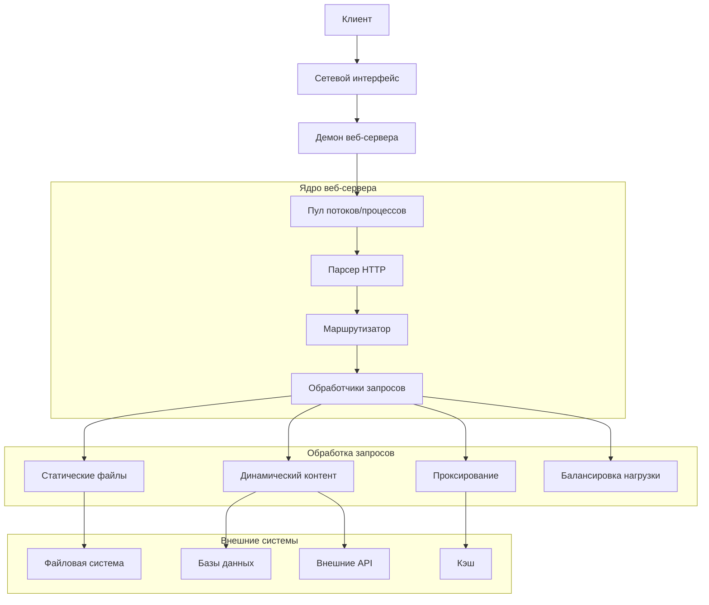
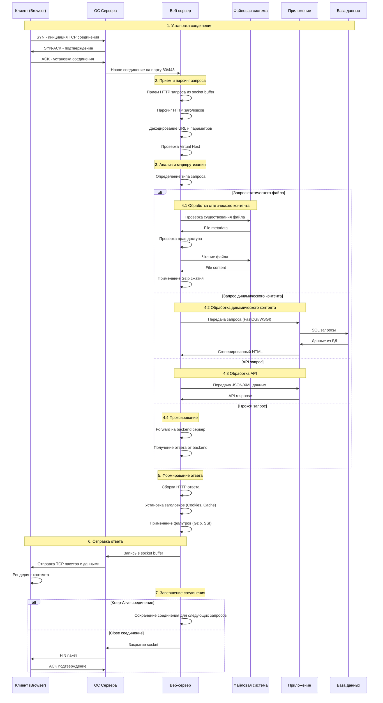
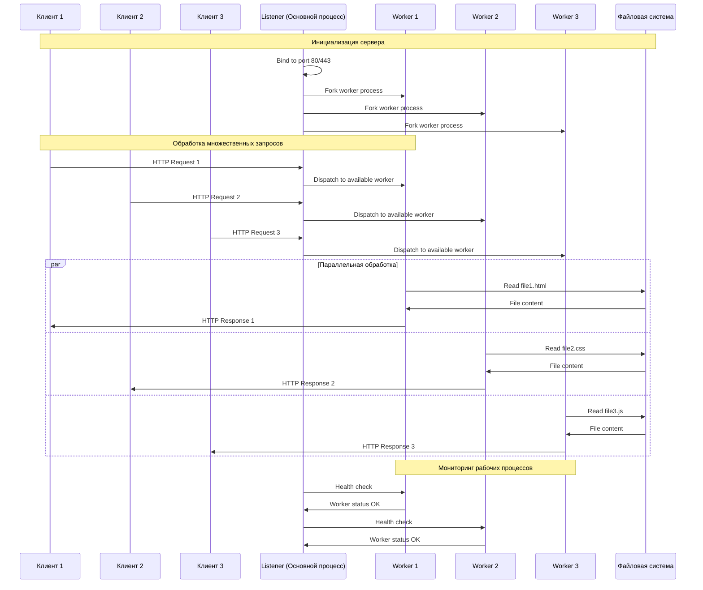
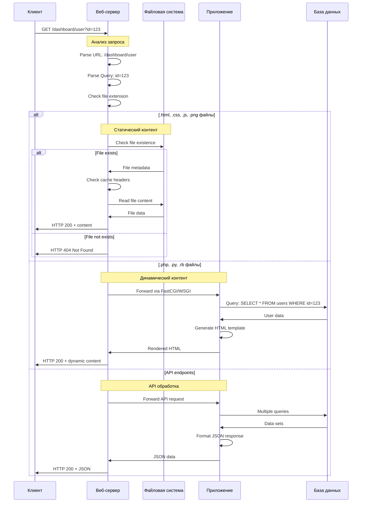
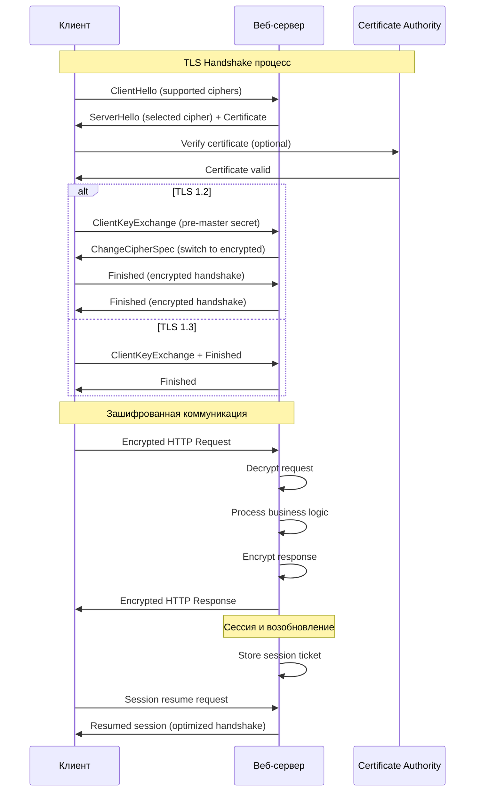
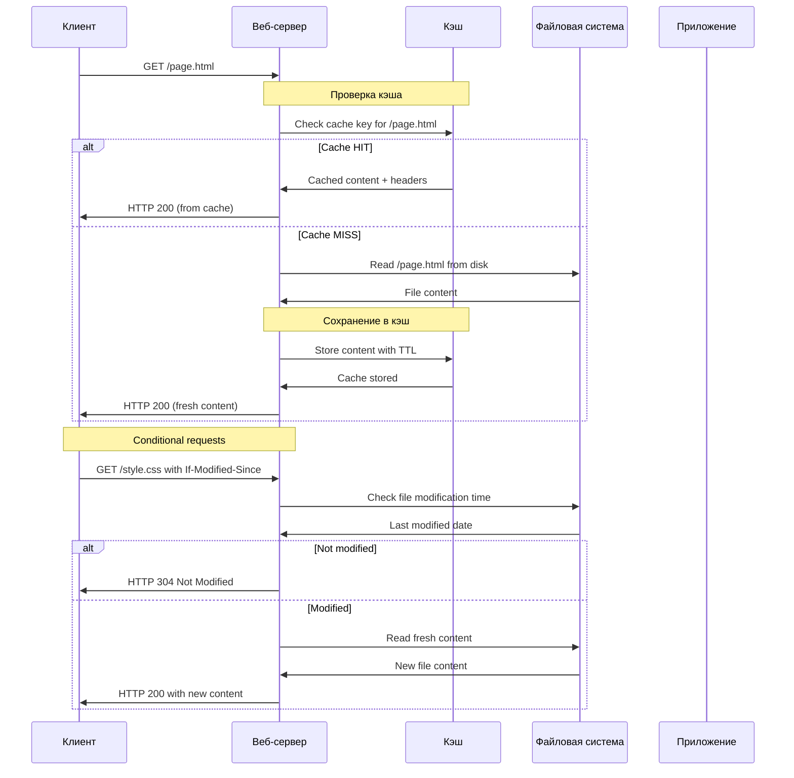
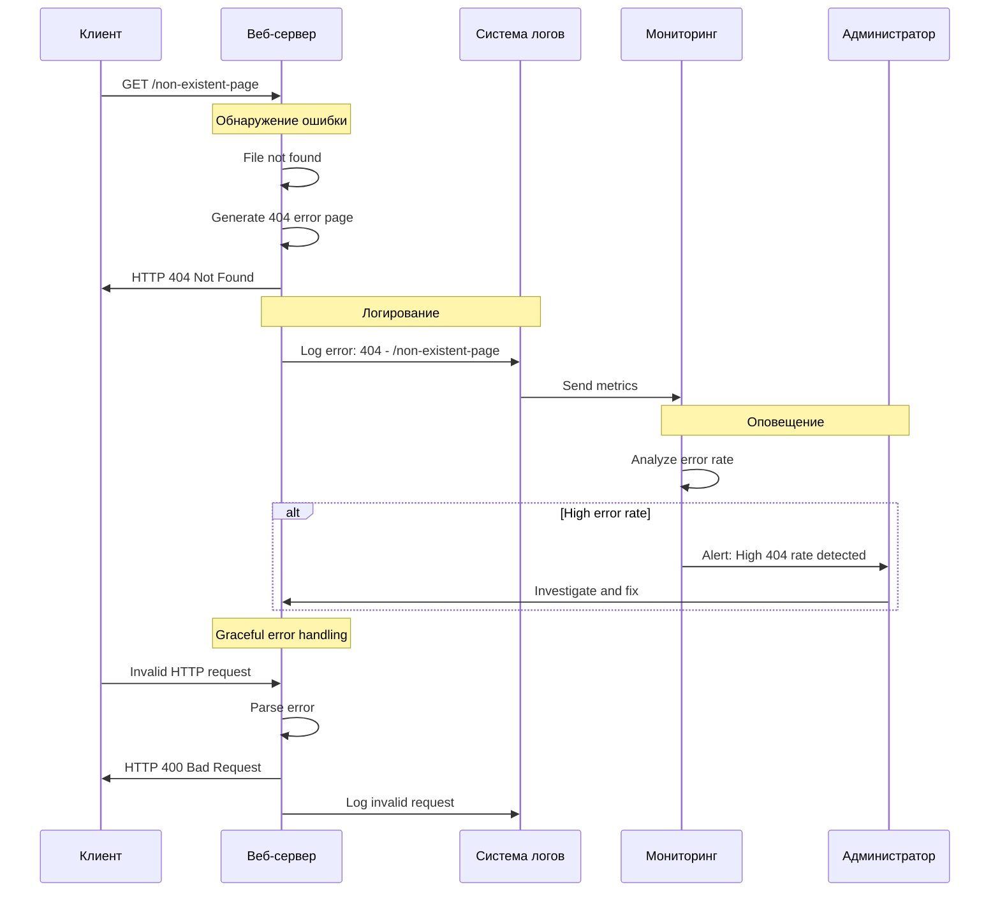

# Веб-сервер: принцип работы и диаграмма последовательностей

## 1. Общая архитектура веб-сервера

## 2. Детальный процесс обработки HTTP запроса

## 3. Процесс работы с пулом потоков

## 4. Обработка статических и динамических файлов

## 5. Процесс SSL/TLS обработки

## 6. Кэширование и оптимизация

## 7. Обработка ошибок и мониторинг

## Ключевые принципы работы веб-сервера:

1. **Мультиплексирование** - обработка множества соединений в одном процессе
2. **Неблокирующие операции** - асинхронная обработка I/O
3. **Пул рабочих процессов** - распределение нагрузки
4. **Кэширование** - оптимизация повторяющихся запросов
5. **Виртуальные хосты** - обслуживание множества доменов
6. **Безопасность** - защита от атак и уязвимостей
7. **Масштабируемость** - обработка растущей нагрузки

